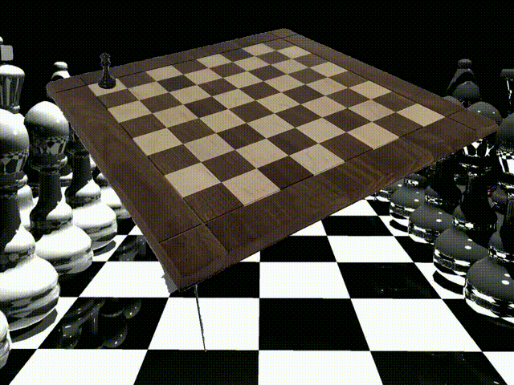
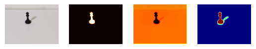
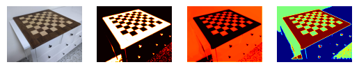
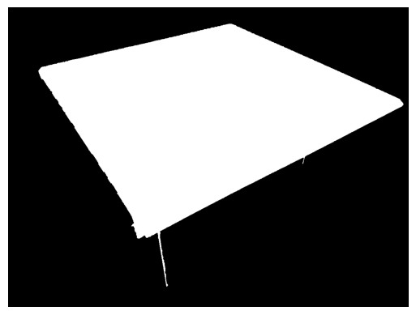

# 8queens
Utilize computer vision techniques to visualize the solution to the classic bruteforcing problem

     

N-Queens Solver:
- Solve N-Queens by bruteforce
- Continue from the last solution to find the next one

Visualization:
- Background/Foreground segmentation with scribbles to separate the chess set from the background
- Use the Djikstra algorithm to propagate scribble information into a trimap
- Trimap Refinement
- Create a homography mapping the "digital" queen placement onto the chessboard

1) Trimap Generation

Input Image -> Foreground Probability Map -> Foreground Distance Map -> Final Trimap (Foreground + Background)

     

     

2) Trimap Refinement

     

     

3) Bruteforce!
